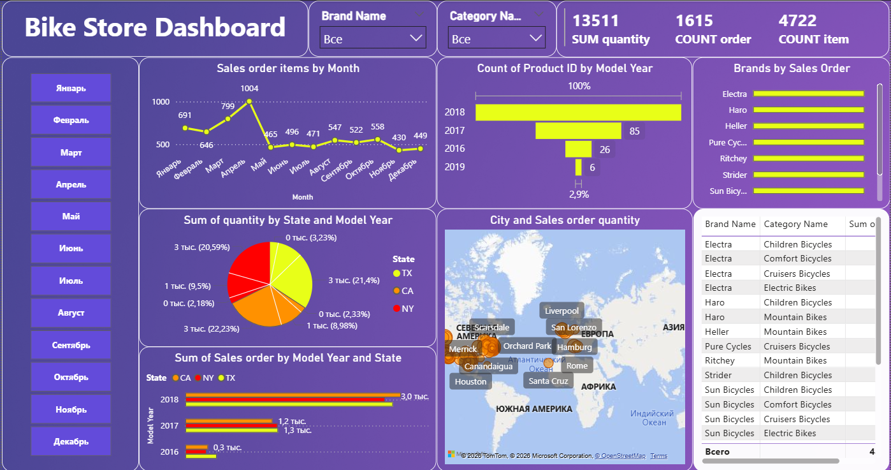

# Bike Store SQL & Power BI Analysis

A practical Data Analytics portfolio project built using the BikeStores sample database in PostgreSQL and Power BI.

The project contains SQL queries designed to practice technical interview skills and solve realistic business problems, combined with an interactive Power BI dashboard for executive reporting and data visualization.

## Project Goals

- Practice SQL for Data Analytics and business analysis
- Develop analytical thinking and SQL problem-solving skills
- Visualize key business metrics and sales trends in Power BI
- Progress from fundamental SQL concepts to advanced analytical techniques
- Build a comprehensive portfolio project for Data Analyst roles

## Technologies & Tools

- **Database:** PostgreSQL
- **Database Client:** DBeaver
- **BI & Visualization:** Power BI Desktop
- **Version Control:** Git, GitHub

## Topics Covered

- ✅ Filtering & Sorting
- ✅ Aggregations
- ✅ JOINs & Advanced JOINs
- ✅ Subqueries
- ✅ Common Table Expressions (CTE)
- ✅ Window Functions
- ✅ Business Cases & Sales Analytics
- ✅ Interactive Dashboarding & Data Modeling (Power BI)

## Power BI Sales Dashboard



The interactive Power BI dashboard provides dynamic visual insights into overall sales performance, top-performing stores, revenue by category, and customer purchasing patterns. 

* The `.pbix` file is available in the [`powerbi/`](PowerBI/) folder.

## Project Structure

```text
bike-store-sql-analysis/
│
├── sql/
│   ├── 01_filtering_sorting.sql
│   ├── 02_aggregations.sql
│   ├── 03_joins.sql
│   ├── 04_joins_advanced.sql
│   ├── 05_subqueries.sql
│   ├── 06_cte.sql
│   ├── 07_window_functions.sql
│   └── 08_business_cases.sql
│
├── powerbi/
│   └── bike_store_analysis.pbix
│
├── dashboard_preview.png
└── README.md
